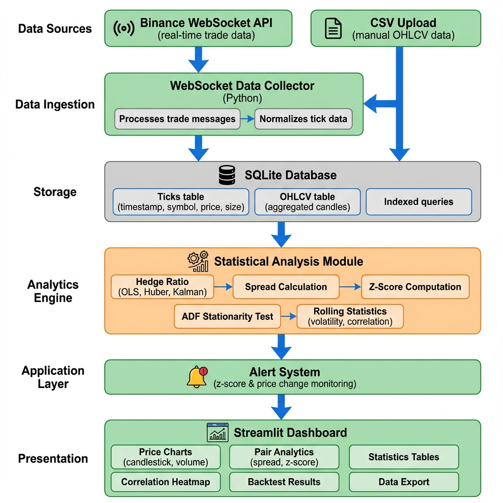

# Architecture Overview

## System Architecture

The Crypto Analytics Platform follows a layered architecture with clear separation of concerns:

### Architecture Diagram

*Also available as editable Draw.io file: `architecture.drawio`*

## Component Description

### 1. Data Sources
- **Binance WebSocket**: Real-time cryptocurrency trade data streams
- **CSV Upload**: Manual OHLCV data upload for historical analysis or custom datasets

### 2. Data Ingestion Layer
**Component**: `data_collector.py`

Responsibilities:
- Establish WebSocket connections to Binance streams
- Handle connection failures and automatic reconnection
- Parse incoming trade messages
- Forward data to storage layer

### 3. Storage Layer
**Component**: `storage.py`

Responsibilities:
- SQLite database management
- Tick-by-tick data storage with timestamp indexing
- OHLCV aggregation and resampling
- Efficient querying for analytics layer
- CSV upload processing

Database Schema:
- `ticks` table: Raw trade data (timestamp, symbol, price, size)
- Indexed by symbol and timestamp for fast queries

### 4. Analytics Layer
**Component**: `analytics.py`

Capabilities:
- **Hedge Ratio Calculation**: OLS, Huber Robust Regression, Kalman Filter
- **Spread Analysis**: Price1 - (beta × Price2)
- **Z-Score Computation**: Normalized spread for trading signals
- **ADF Stationarity Test**: Cointegration validation
- **Rolling Statistics**: Volatility, correlation, momentum
- **Returns & Metrics**: Percentage changes, drawdowns

### 5. Alert System
**Integrated in**: `analytics.py` and `dashboard.py`

Alert Types:
- **Z-Score Alerts**: Triggered when |z-score| exceeds threshold
- **Price Change Alerts**: Triggered on significant price movements
- **Real-time Notifications**: Displayed in dashboard UI

### 6. Frontend Layer
**Component**: `dashboard.py`

Streamlit-based interface providing:
- Real-time price charts (candlestick, volume, trades)
- Pair analytics visualization (spread, z-score, correlation)
- Statistical summaries and tables
- Alert panel showing active notifications
- Data export functionality
- Configuration controls (symbols, timeframes, parameters)

## Data Flow

1. **Ingestion**: WebSocket connects → receives trade data → stores in database
2. **Processing**: Dashboard queries database → requests analytics → receives computed metrics
3. **Display**: Charts rendered with Plotly → updates on auto-refresh
4. **Alerts**: Analytics engine monitors thresholds → triggers alerts → displayed in UI

## Scalability Considerations

- **Database**: SQLite suitable for single-user, local deployments. For production, migrate to PostgreSQL/TimescaleDB
- **WebSocket**: Currently handles 2 symbols. Can scale to dozens with asyncio
- **Analytics**: Computations done on-demand. Consider caching for high-frequency updates
- **Frontend**: Streamlit runs single-threaded. For multi-user, deploy with load balancer

## Technology Stack

| Layer | Technology |
|-------|------------|
| Frontend | Streamlit, Plotly |
| Analytics | pandas, numpy, scipy, statsmodels, pykalman, scikit-learn |
| Storage | SQLite3 |
| Ingestion | websockets (async) |
| Deployment | Python subprocess management |

## Deployment Model

Single-command execution (`python app.py`) launches:
1. Data collector process (background)
2. Streamlit dashboard (foreground, auto-opens browser)

Both processes run concurrently and communicate via shared SQLite database.

## Future Enhancements

- Multi-exchange support (Coinbase, Kraken, etc.)
- Advanced order book analytics
- Machine learning price prediction models
- Cloud deployment with horizontal scaling
- Real-time API for algorithmic trading integration
